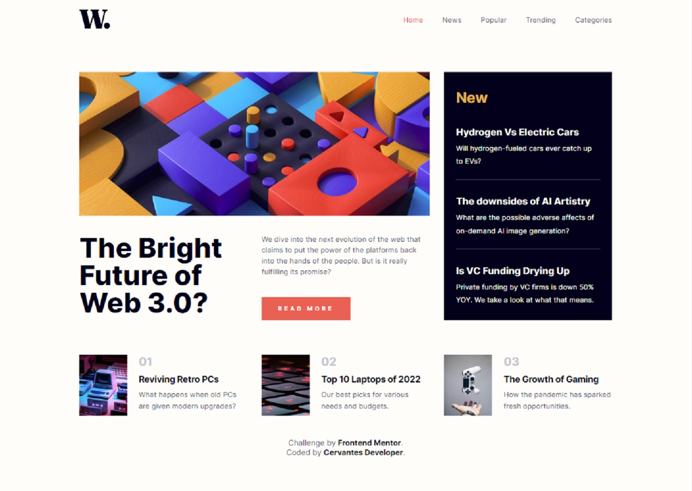

# Frontend Mentor - News homepage solution

This is a solution to the [News homepage challenge on Frontend Mentor](https://www.frontendmentor.io/challenges/news-homepage-H6SWTa1MFl). Frontend Mentor challenges help you improve your coding skills by building realistic projects. 

## Table of contents

- [Overview](#overview)
  - [The challenge](#the-challenge)
  - [Screenshot](#screenshot)
  - [Links](#links)
- [My process](#my-process)
  - [Built with](#built-with)
  - [What I learned](#what-i-learned)
  - [Continued development](#continued-development)
  - [Useful resources](#useful-resources)
- [Author](#author)

## Overview

### The challenge

Users should be able to:

- View the optimal layout for the interface depending on their device's screen size
- See hover and focus states for all interactive elements on the page

### Screenshot

### Links

- Solution URL: [Add solution URL here](https://github.com/cervantesdeveloper/19_fem_newsHomepage.git)
- Live Site URL: [Add live site URL here](https://19-fem-news-home.netlify.app/)

## My process

### Built with

- Semantic HTML5 markup
- CSS custom properties
- Flexbox
- CSS Grid
- Mobile-first workflow
- [React](https://reactjs.org/) - JS library
- [VITE](https://vitejs.dev/)

### What I learned

I started to use React Router V6 and I learned to create nested routes.
Also I learned a little bit about css grid.

### Continued development

I will be practicing React and React router.

### Useful resources

- [CSS tricks](https://css-tricks.com/) - It has a plenty examples of CSS grid properties.

## Author

- Website - [Cervantes Developer](https://cervantesdeveloper.com/)
- Frontend Mentor - [@cervantesdeveloper](https://www.frontendmentor.io/profile/cervantesdeveloper)
- Twitter - [@Cervantes_Dev](https://twitter.com/Cervantes_Dev)
